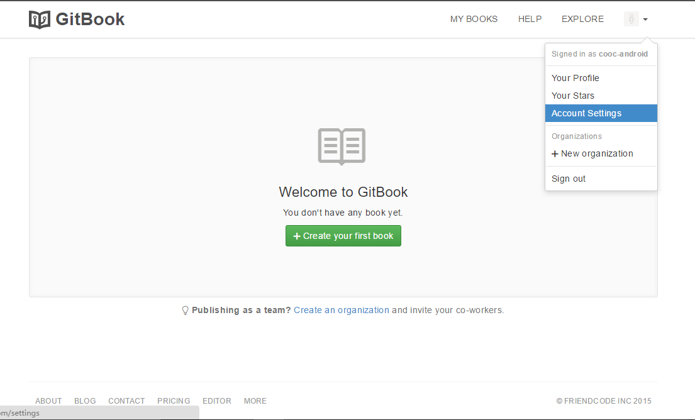

# 二、创建书并关联GitHub仓库

---

1.打开[GitBook](https://www.gitbook.com)，输入相应信息，点击注册，登录注册的邮箱进行确认。

2.新建一个浏览器窗口并登录你的GitHub账号。

3.回到Gitbook中创建一本新的书(create your first book)，书的名字为test。

    
4.进入这本书中，先选中settings，然后复制下图中的gitbook中的地址，这个地址用于将这本书的URL传给github中的某个仓库中。

5.进入网址[github.com/new/import](https://github.com/new/import)中,将刚才复制的地址复制到URL中，并创建一个github仓库，这样github就可以通过这个地址与gitbook进行同步。

6.点击上图的Begin import后，要输入你的github的账号和密码。

7.导入成功后，gitbook中的内容就导入到github中了。

8.完成gitbook的导入后，只是将gitbook中的地址给了github，还需将github的地址给gitbook，此时我们就需要回到gitbook中，添加一下github对应的仓库，即我们第五步创建的test_android仓库。

9.建立了github与gitbook的联系以后，我们就可以安静的写书了，首先我们需要下载Gitbook客户端，在客户端中用markdown编辑既方便又快捷，我们首先需要将我们在云端的test这本书下载到本地，编辑后再将test上传到云端，下载如下图所示：

10.进入这本书以后，就可以编辑了：

11.写完后同步到云端：

12.同步后，就可以登陆gitbook和github上，发现仓库中的内容发生了变化，所以我们以后就可以在Gitbook客户端上编写，然后上传到云端以网页的形式显示出来。

**现在已经将GitBook上书的仓库和GitHub上书的仓库关联起来了，以后既可以通过GitBook写书，也可以将更新提交到GitHub，极大的方便了多人协作撰写一本课本。**

**以后就可以通过**[**https:\/\/username.gitbook.io\/仓库名\/**](https://username.gitbook.io/仓库名/)** 在线阅读或下载图书。**

_下面介绍通过GitBook客户端撰写的方法。_

