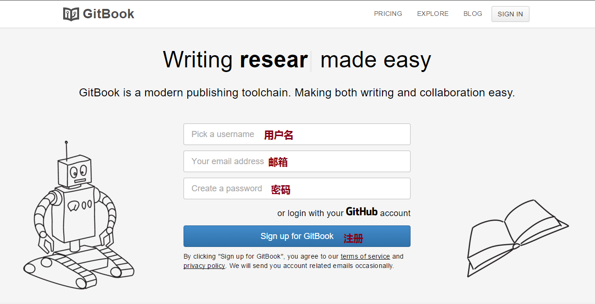
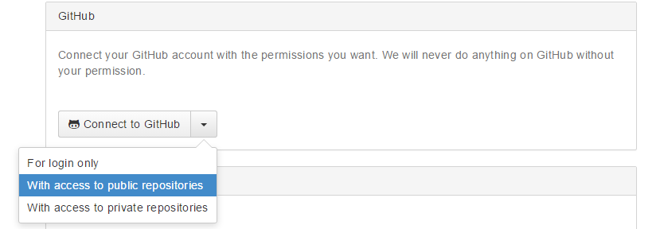
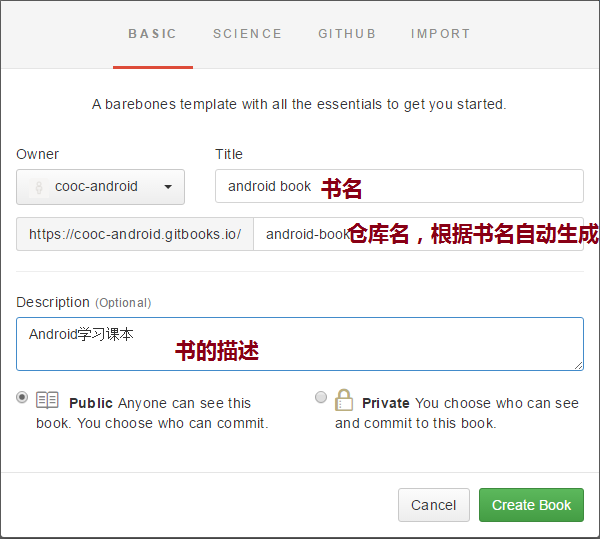
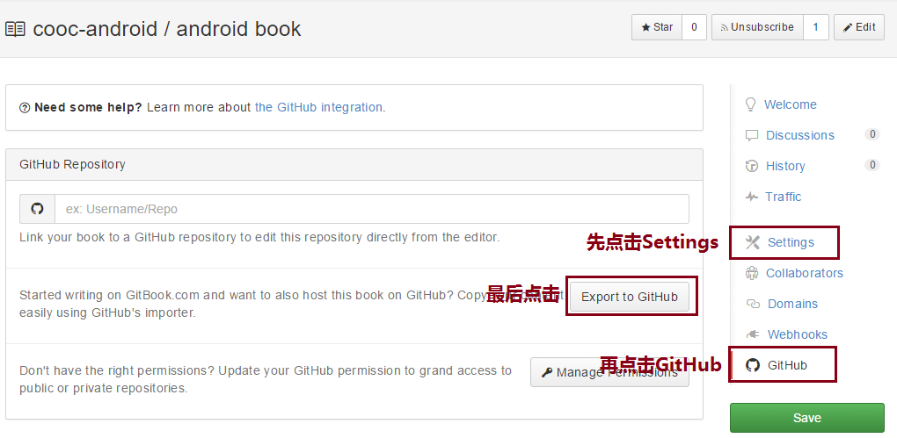
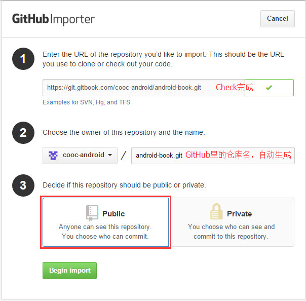
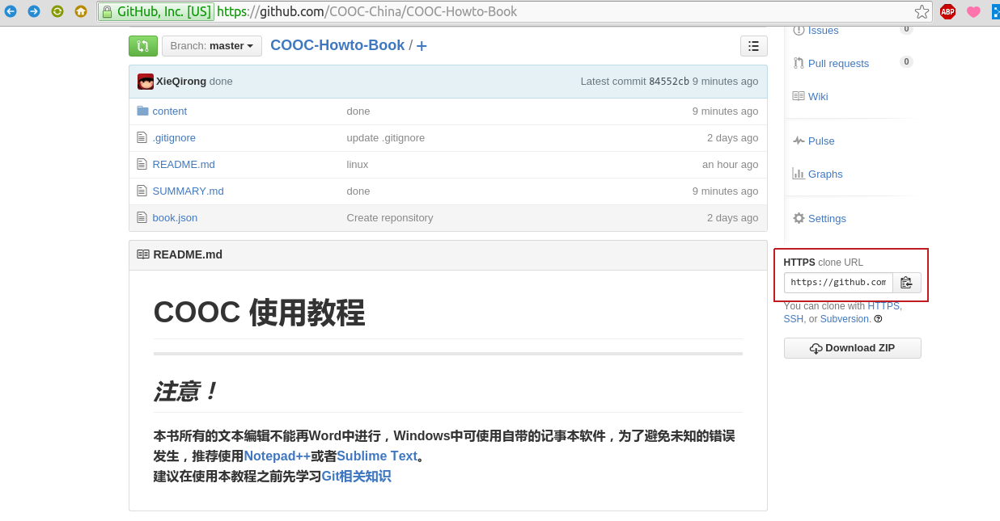

# 二、创建书并关联GitHub仓库

---

1.打开[GitBook](https://www.gitbook.com)，输入相应信息，点击注册，登录注册邮箱确认。

2.新建一个浏览器窗口并登录你的GitHub账号。

3.回到Gitbook中创建一本新的书(create your first book)。

4.进入这本书中，先选中settings，

5.创建一本书

6.将书的GitBook仓库与GitHub仓库关联

7.在GitHub的导入页，先点击`Check URL`，等待检查完成，选择`Public`，再点击`Begin import`。

8.在授权页输入GitBook用户名和密码，授权。等待导入完成。完成后在GitHub里查看远程仓库的地址（图中红色线框处）

**现在已经将GitBook上书的仓库和GitHub上书的仓库关联起来了，以后既可以通过GitBook写书，也可以将更新提交到GitHub，极大的方便了多人协作撰写一本课本。**

**以后就可以通过**[**https:\/\/username.gitbook.io\/仓库名\/**](https://username.gitbook.io/仓库名/)** 在线阅读或下载图书。**

_下面介绍通过GitBook客户端撰写的方法。_

