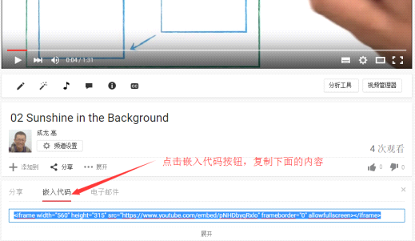
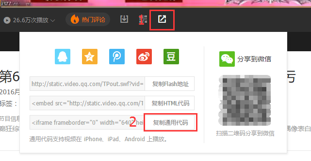

# 四、嵌入视频、讲义等多媒体内容

原则上任何互联网上的安全内容都可以被嵌入到我们的教程中。

## 视频

嵌入的视频建议托管到Youtube或者腾讯视频上，具体操作如下：

1. 视频上传到对应的平台，等待审核通过。

2. 审核通过后打开视频的播放页面，点击分享按钮。

3. Youtube会显示：

   

   腾讯视频会显示：

   

4. 复制好通用代码，粘贴到教程中相应的位置。注意腾讯平台需要把分享代码中的"http"改为"https"，分享代码前后均需要用空行隔开。

