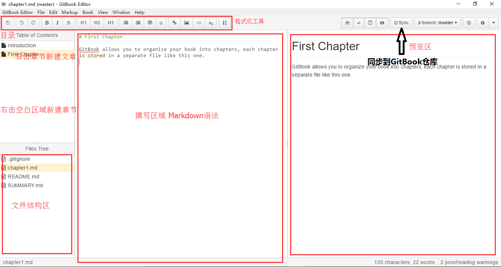

三、安装环境、写作
===
---

1.下载并安装[GitBook客户端](http://downloads.editor.gitbook.com/)   
2.打开GitBook客户端并登录。   
3.点击`GITBOOK.COM`，并点击要编辑的书。
    
4.GitBook还是使用[Markdown](http://wowubuntu.com/markdown/)语法书写，下面介绍编辑面板：
   
每次写完请记得点击`Sync`按钮将增加或修改的内容提交到远程仓库里。