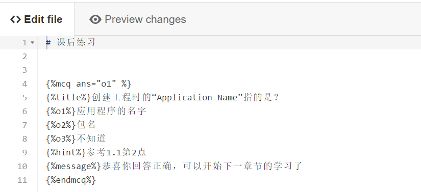
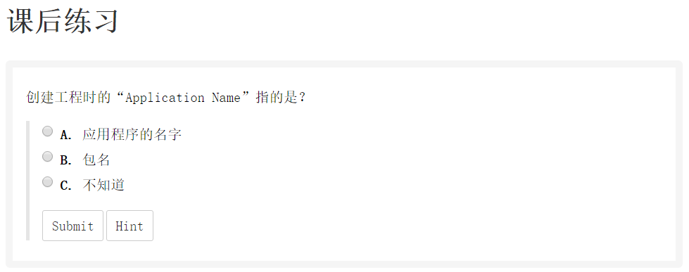

# 准备工作
## 课程内容

### 教程
教程编写可以使用GitBook的网站在线编写或者下载GitBook的编辑工具离线编写，后面一节我们将分操作系统进行介绍GitBook的使用方法。

教程中可以编写文字性的内容，比如目录，正文等等，正文中可以在希望插入图片的位置与文字分开一行空行后，输入``，视频讲义也是类似，需要分开一个空行，然后输入相应内容

### 视频
视频可以上传到Youtube或者腾讯视频(方便国内访问)，上传完成后在视频播放页面中，如下图所示，鼠标悬停到“1”的位置，点击“2”。有些浏览器不支持直接复制，点击代码框手动完成复制即可

复制之后我们将得到类似这样的代码：`<iframe frameborder="0" width="640" height="498" src="http://v.qq.com/iframe/player.html?vid=y0308332gaov4&tiny=0&auto=0" allowfullscreen></iframe>`

### 讲义

### 练习
在编写完教程内容之后，还可以借助excise插件添加对应知识点的考查练习题目（目前仅支持选择、填空这类答案唯一的题目），并且可以编写提示，excise插件编写题目需要使用模板语言，如下图中是本教程第一章的练习题编写方式，

可以以此为模板进行习题编写，编写好的习题效果如图

## 引入协作
首先在GitHub和GitBook上完成注册。登录到GitBook账户，在Account Settings页面中与GitHub进行关联。这样对于公共仓库，其它合作编写者就可以方便的利用GitHub提供的web接口进行分支和关于教程建设的话题讨论
## 发布到COOC
首先在COOC主页的导航栏上点选“教程收录”，下图所示页面，在这个issue上发起编写号召，可以附上邮箱或者已经建立好的教程链接。

COOC平台对该issue定期更新，以明确编写主题，形成内容框架，完成线上报名并组织多人协作分工撰写。在线上报名完成的同时，COOC也会针对issue讨论中无法完成的内容，向专家学者发出编写邀请，以完成教程内容的完整构建。