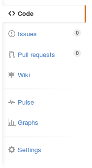
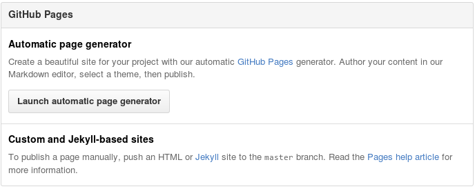
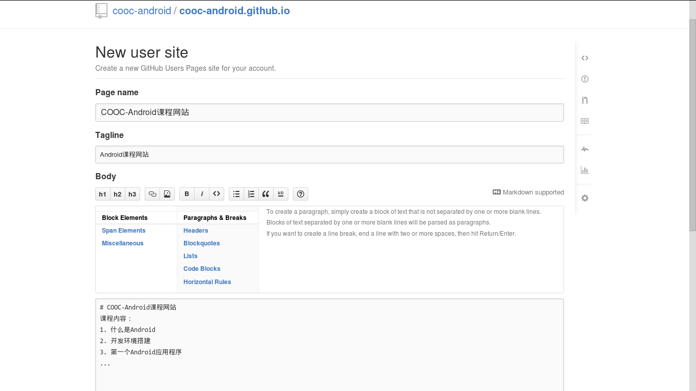
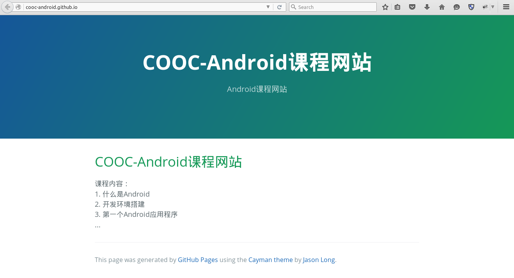

# 1.注册GitHub帐号
打开[GitHub首页](https://github.com)，输入用户名、邮箱、密码，再点击 `Sign up for GitHub`，如果已有帐号则直接点击右上角的`Sign in`登录。

接下来选择`Free`，不要勾选`Help me set up an organization next`，点击`Finish sign up`完成注册。

# 2.创建一个仓库（必须完成邮箱验证）
点击`New repository`创建一个仓库，**仓库名必须为`username.github.io`**，其中`username`为你的用户名，`Description`可选，**仓库必须为`Public`**，`Initionalize`可选，点击`Create reponsitory`完成仓库创建。

# 3.打开自动生成网页功能
点击`Settings`，在接下来的页面点击`Launch automatic page generator`。    
 

# 4.编辑网页
编辑网页标题、内容等，完成后点击`Continue to layouts`选择网页的样式。

# 5.选择网页样式
在上方选择样式，下方可以预览当前选择的样式，如果对内容不满意可以点击`Edit`编辑，完成后点击`Publish page`发布网页。

# 6.访问网站
发布后可通过http://username.github.io/ 访问你的网站   

   
   使用自动生成网页功能建立网站非常简单，但是修改起来比较麻烦，需要掌握一些网站前端的知识，因此推荐使用[基于Jekyll自定义网站](jekyll.md)