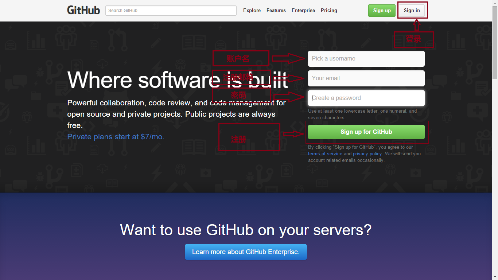
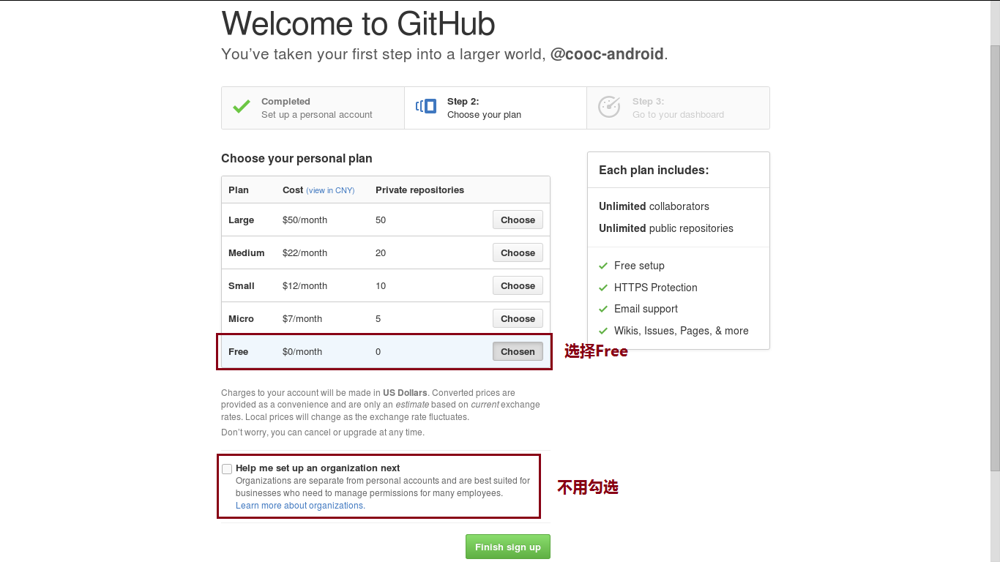
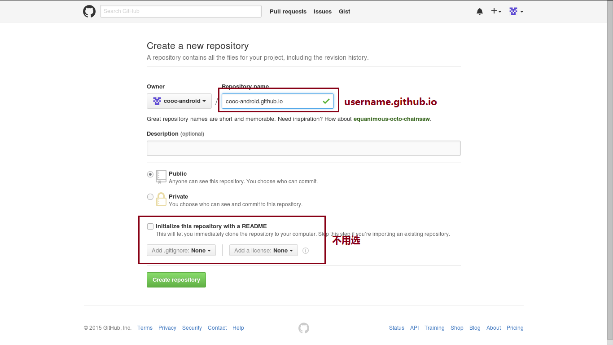
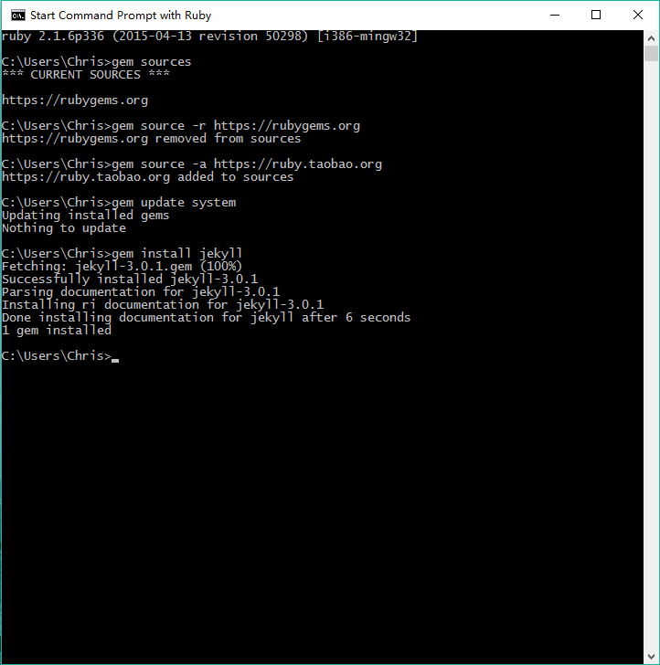

# GitHub搭配Jekyll，创建COOC课程网站（以Windows平台为例）

## 1.相关内容介绍

#### (1)GitHub
GitHub是目前全球最流行的开源协作社区，目前，除了Git代码仓库托管及基本的Web管理界面以外，还提供了订阅、讨论组、文本渲染、在线文件编辑器、协作图谱（报表）、代码片段分享（Gist）等功能。正因为这些功能所提供的便利，又经过长期的积累，GitHub的用户活跃度很高，在开源世界里享有深远的声望，形成了所谓的社交化编程文化（Social Coding）。

#### (2)Jekyll

[Jekyll](http://jekyll.bootcss.com/)是一种简单的、适用于博客的、静态网站生成引擎。它使用一个模板目录作为网站布局的基础框架，支持Markdown、Textile等标记语言的解析，提供了模板、变量、插件等功能，最终生成一个完整的静态Web站点。说白了就是，只要安装Jekyll的规范和结构，不用写HTML，就可以生成网站

## 2.环境搭建

#### (1)GitHub
1.打开[GitHub](https://github.com)创建GitHub账户   

2.在GitHub上建立一个仓库，仓库名规则：username.github.io（username为你的GitHub用户名）   

3.下载并安装最新的[GitHub客户端](https://github-windows.s3.amazonaws.com/GitHubSetup.exe)   
4.打开GitHub客户端，输入之前注册的账号，登录，配置你的GIT（此处输入你姓名拼音和你的邮箱），然后点击`dashboard`   
5.点击左上角的加号，点击`Create`，Name输入：username.github.io（username为你的GitHub用户名），点击`Browse`   定位到C:\User\你的用户名 这个文件夹，点击`Create reponsitory`，创建一个本地仓库完成

#### (2)Jekyll
1.下载并安装最新的[Rubyinstaller](http://files.bryanbibat.net/rails-ftw-v0.21-2.1.6-4.2.3.exe)，注意！安装时勾选`Add Ruby executables to your PATH`，且安装路径不能包含空格。   
2.安装完成后从开始菜单打开`Start Command Prompt with Ruby`   
3.运行`gem sources`查看gem安装源列表   
4.运行`gem source -r 刚才看到的源`删除gem默认的官方源（因为官方源被墙）   
5.运行`gem source -a https://ruby.taobao.org`将官方源改成淘宝源   
6.运行`gem update system`更新一下gem   
7.运行`gem install jekyll`安装Jekyll，安装完成后运行`jekyll -veriosn`查看是否安装成功   

## 3.初始化

1. 还是在`Start Command Prompt with Ruby`中，运行`cd username.github.io（username为你的GitHub用户名）`，进入刚才创建的仓库。  
2. 运行`jekyll new .`，`.`代表当前文件夹，这是这个仓库文件夹里会生成Jekyll相关的文件及文件夹，该文件夹下的_config.   yml文件为该站点的配置文件，_posts文件夹里放的就是Mardkdown文件，也就是每一个网页的文件。
3. 在Windows文件管理中打开COOC文件夹，打开_config.yml配置站点信息：

    title:网站的标题
    email:网站作者的邮箱
    description:该网站的一些描述，主要是搜索引擎检索网站使用
    baseurl:网站的根目录（默认即可）
    url:网站的域名
    github_uername:网站作者的GitHub的用户名
    其他信息忽略，配置完成之后保存。

4. 运行`jekyll serve`（按Ctrl+C停止）    
这时打开浏览器，输入 http://127.0.0.1:4000 就可以看到网站了，然而此时只能在我们自己的电脑上浏览到网站，其他地方的其他人并不能通过这个链接访问这个网站，要想让其他人也能访问就需要借助GitHub了。   
5. 打开GitHub客户端，点击“username.github.io（username为你的GitHub用户名）”这个仓库，再点击右上角的设置按钮，选择`Reponsitory settings`，然后在remote中输入之前在GitHub上创建的仓库的地址，点击OK保存。   
6. 再点击右侧面板中的`Changes`，在下方的Summary中输入提交信息（如init）后点击`Commit to master`，再点击右上方的`Publish`，此时这个本地的仓库就被同步到GitHub中的仓库里去了，同时，你和其他人也可以通过 http://username.github.io （username为你的GitHub用户名）这个地址访问你的网站了

## 4.写课程

1.在_post文件夹中创建一个Markdown文件，命名规则为：`年-月-日-文件名（不能为中文）`，如：2015-11-19-github-jekyll-course.md   
2.在刚才创建的课程页面文件中加入以下头信息

    ---
    layout: post
    title:  "课程名，如：GitHub搭配Jekyll，创建COOC课程网站（以Windows平台为例）"
    date:   创建时间，格式为：2015-11-19 14:43:48 +0800
    ---

3.接下里就可以按Markdown格式自由书写课程内容了
[Markdown格式标准](http://wowubuntu.com/markdown/)