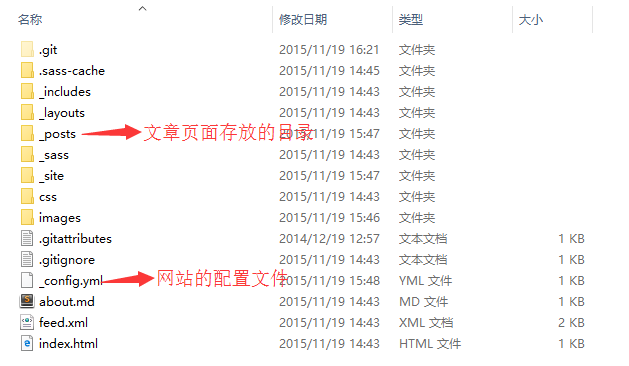
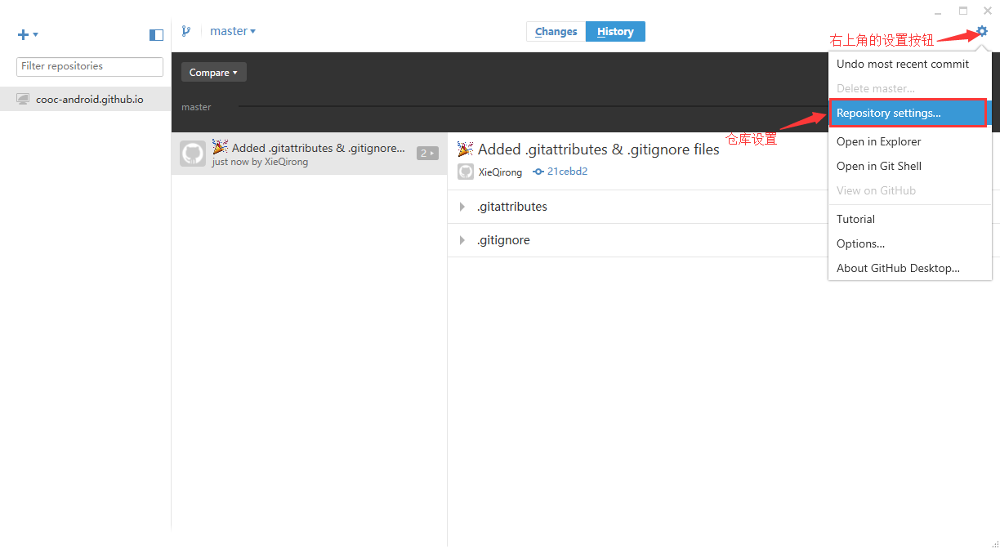
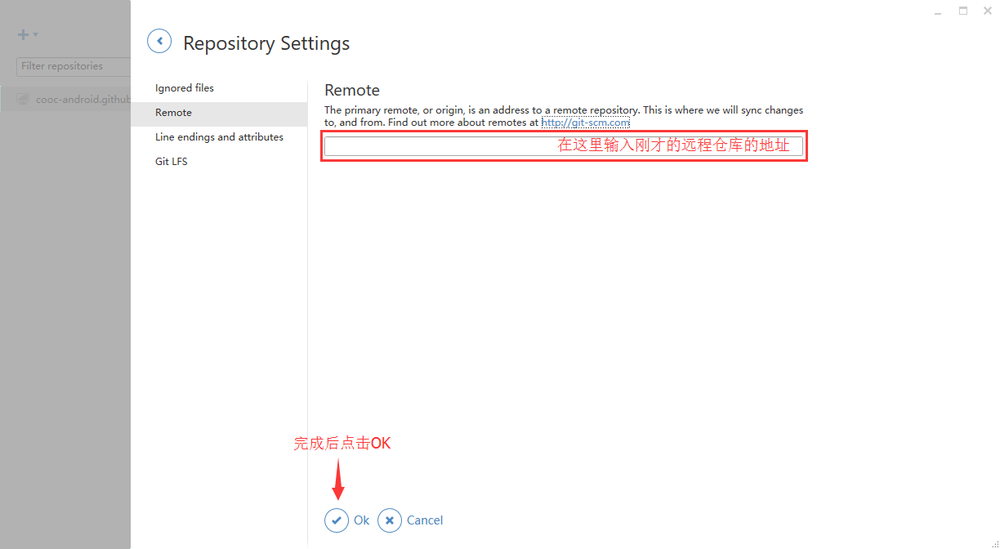
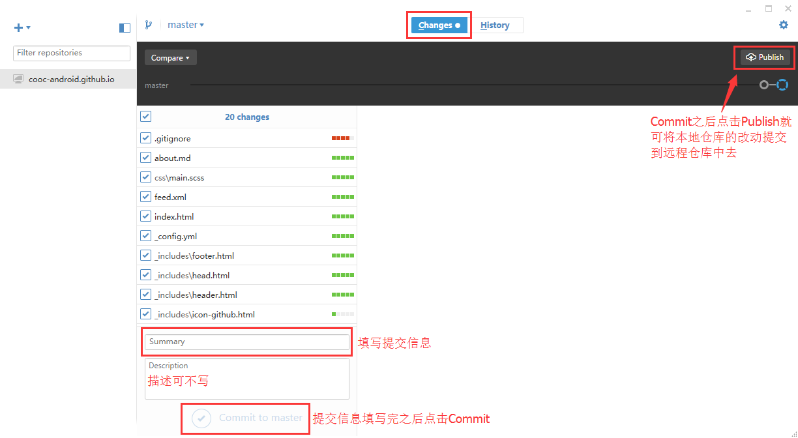

三、初始化Jekyll文件夹
===
---

1. 还是在`Start Command Prompt with Ruby`中，运行`cd username.github.io（username为你的GitHub用户名）`，进入刚才创建的本地仓库。  
2. 运行`jekyll new .`，`.`代表当前文件夹，这时本地仓库文件夹里会生成Jekyll相关的文件及文件夹，该文件夹下的_config.yml文件为该站点的配置文件，_posts文件夹里放的就是Mardkdown文件，也就是每一个网页的文件，。    
    
3. 在Windows文件管理中打开本地仓库文件夹，打开_config.yml配置站点信息：
<pre><code>
	title:网站的标题
	email:网站作者的邮箱
	description:该网站的一些描述，主要是搜索引擎检索网站使用
	baseurl:网站的根目录（默认即可）
	url:网站的域名
	github_uername:网站作者的GitHub的用户名
	其他信息忽略，配置完成之后保存。
</code></pre>

4. 运行`jekyll serve`（按Ctrl+C停止）    
这时打开浏览器，输入 http://127.0.0.1:4000 就可以预览网站了，然而此时只能在我们自己的电脑上浏览到网站，其他地方的其他人并不能通过这个链接访问这个网站，要想让其他人也能访问就需要借助GitHub了。   
5. 打开GitHub客户端，选中“username.github.io”这个仓库，再点击右上角的设置按钮，选择`Reponsitory settings`，然后在remote中输入之前在GitHub上创建的仓库的地址，点击OK保存。    
    

6. 再点击右侧面板中的`Changes`，在下方的Summary中输入提交信息（如init）后点击`Commit to master`，再点击右上方的`Publish`，耐心等待本地仓库就被提交到远程仓库里去，提交完成后你和其他人就可以通过 http://username.github.io 这个地址访问你的网站了
  