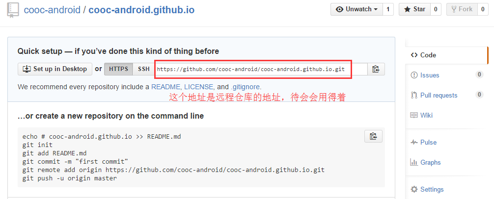

创建仓库
===
---

### 创建远程仓库
在GitHub上建立一个远程仓库，仓库名规则：username.github.io（username为你的GitHub用户名）   
   
   

### 创建本地仓库
在终端中运行：

	$ jekyll new username.github.io（username为你的github用户名）
	$ cd username.github.io
	$ git init
	$ git add -A
	$ git commit -m "init"
	$ git remote add origin 远程仓库地址
	$ git push -u origin master

现在已经成功创建了本地仓库和远程仓库，以及Jekyll站点目录，并且将本地仓库的Jekyll目录同步到了远程仓库里。